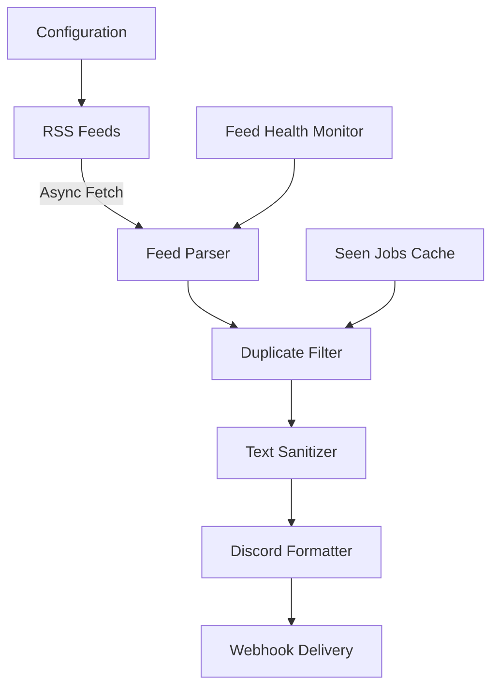

# GitJobHunter 🎯

**An intelligent, asynchronous job aggregator that monitors multiple RSS feeds and delivers personalized job notifications to Discord.**

[](https://www.python.org/downloads/)
[](LICENSE)
[](tests/)

## 🌟 Overview

GitJobHunter is a sophisticated job monitoring system that automatically scans 13+ pre-configured RSS feeds from popular job boards, filters out duplicates, and sends beautiful Discord notifications for new opportunities. Built with Python's async capabilities for optimal performance and reliability.

## ✨ Key Features

### 🔄 **Intelligent Feed Processing**
- **Asynchronous feed fetching** - Processes multiple job feeds concurrently
- **13+ pre-configured feeds** including WeWorkRemotely, RemoteOK, Hacker News, Indeed, Monster, and more
- **Smart retry logic** with exponential backoff for network resilience
- **Feed health monitoring** - Automatically disables problematic feeds after consecutive failures

### 🎨 **Rich Discord Integration**
- **Mobile-optimized embeds** with job details, source information, and apply links
- **Batch notifications** - Groups jobs into digestible chunks (max 10 per message)
- **Smart text sanitization** - Handles HTML entities and dangerous characters
- **Timestamp validation** - Properly formats publication dates

### 🛡️ **Reliability & Monitoring**
- **Duplicate detection** - Tracks seen jobs with timestamps for efficient filtering
- **Automatic cleanup** - Removes old job entries (configurable, default 30 days)
- **Comprehensive logging** - File and console logging with configurable levels
- **Health checks** - Validates configuration and system requirements

### ⚙️ **Enterprise-Grade Configuration**
- **Environment-based config** - All settings configurable via environment variables
- **JSON schema validation** - Ensures feed configuration integrity
- **Feed management CLI** - Enable/disable feeds, reset health status, cleanup old data
- **Flexible deployment** - GitHub Actions, cron jobs, or manual execution

## 🏗️ Architecture

### Core Components

```
GitJobHunter/
├── 📁 Core Application
│   ├── job_finder.py           # Main async job processor
│   └── feed_health_manager.py  # CLI feed management utility
├── 📁 Configuration
│   ├── config.json            # Production feed configurations (13 feeds)
│   ├── config.test.json       # Test configuration
│   └── requirements.txt       # Python dependencies
├── 📁 Data Persistence
│   ├── seen_jobs.json         # Timestamped job tracking
│   ├── feed_health.json       # Feed reliability metrics
│   └── job_finder.log         # Application logs
├── 📁 Testing & QA
│   ├── tests/test_job_finder.py # Comprehensive test suite
│   ├── pytest.ini             # Test configuration
│   └── install_and_test.sh    # Setup and validation script
└── 📁 Documentation
    ├── README.md              # This file
    └── LICENSE                # MIT license
```

### Data Flow



## 🚀 Quick Start

### Prerequisites
- Python 3.10+
- Discord server with webhook access
- Internet connection for RSS feeds

### 1. Installation

```bash
git clone https://github.com/YOUR_USERNAME/GitJobHunter.git
cd GitJobHunter

# Install dependencies
pip install -r requirements.txt

# Run setup validation
./install_and_test.sh
```

### 2. Discord Webhook Setup

**Create Discord Webhook:**
1. Open Discord → Go to your server
2. Right-click target channel → **Edit Channel**
3. **Integrations** → **Webhooks** → **Create Webhook**
4. Copy the webhook URL

**Test Your Webhook:**
```bash
curl -X POST "YOUR_WEBHOOK_URL" \
  -H "Content-Type: application/json" \
  -d '{"content":"✅ GitJobHunter webhook test successful!"}'
```

### 3. Configuration

```bash
# Set Discord webhook (required)
export DISCORD_WEBHOOK_URL="https://discord.com/api/webhooks/YOUR/WEBHOOK/URL"

# Optional environment variables
export LOG_LEVEL="INFO"                    # DEBUG, INFO, WARNING, ERROR
export MAX_JOBS_PER_RUN="50"              # Limit notifications per run
export CLEANUP_AGE_DAYS="30"              # Job retention period
export FEED_FAILURE_THRESHOLD="5"         # Auto-disable after N failures
```

### 4. Run the Application

```bash
# Single run
python job_finder.py

# With debug logging
LOG_LEVEL=DEBUG python job_finder.py

# Using test configuration
CONFIG_FILE=config.test.json python job_finder.py
```

## 📋 Pre-configured Job Sources

| Source | Feed Type | Focus Area | Status |
|--------|-----------|------------|--------|
| **WeWorkRemotely** | All Jobs + Programming | Remote-first positions | ✅ Active |
| **RemoteOK** | Developer Focus | Global remote tech jobs | ✅ Active |
| **Remotive** | All Remote | Curated remote opportunities | ✅ Active |
| **Hacker News** | Jobs + Who's Hiring | Startup and tech positions | ✅ Active |
| **Indeed** | Search-based | Software Engineer (Remote) | ✅ Active |
| **Monster** | Search-based | General job search | ✅ Active |
| **Upwork** | Freelance | Project-based work | ✅ Active |
| **Craigslist** | Local | Regional opportunities | ✅ Active |
| **Eluta.ca** | Canada-focused | Canadian job market | ✅ Active |
| **JobServe** | UK Agency | Recruitment agencies | ✅ Active |
| **Custom WordPress** | Niche feeds | Specialized job boards | ✅ Active |

> **Total:** 13 feeds configured • **Coverage:** Global • **Update Frequency:** Real-time

## 🔧 Advanced Configuration

### Feed Management CLI

```bash
# View feed health status
python feed_health_manager.py --status

# Reset specific feed health
python feed_health_manager.py --reset "RemoteOK - All Remote Jobs"

# Enable/disable feeds
python feed_health_manager.py --enable "Feed Name"
python feed_health_manager.py --disable "Feed Name"

# Cleanup old health data
python feed_health_manager.py --cleanup 30
```

### Custom Feed Configuration

Edit `config.json` to add new feeds:

```json
{
  "feeds": [
    {
      "name": "Custom Job Board",
      "url": "https://example.com/jobs.rss",
      "source": "Example Company",
      "category": "tech/custom",
      "params": {"q": "python", "remote": "true"},
      "enabled": true
    }
  ]
}
```

### Environment Variables

| Variable | Default | Description |
|----------|---------|-------------|
| `DISCORD_WEBHOOK_URL` | - | **Required**: Discord webhook URL |
| `CONFIG_FILE` | `config.json` | Path to feed configuration |
| `SEEN_JOBS_FILE` | `seen_jobs.json` | Job tracking database |
| `FEED_HEALTH_FILE` | `feed_health.json` | Feed reliability metrics |
| `MAX_JOBS_PER_RUN` | `50` | Maximum jobs per notification |
| `REQUEST_TIMEOUT` | `30` | HTTP request timeout (seconds) |
| `MAX_RETRIES` | `3` | Network retry attempts |
| `RETRY_DELAY` | `2` | Base retry delay (seconds) |
| `CLEANUP_AGE_DAYS` | `30` | Job retention period |
| `LOG_LEVEL` | `INFO` | Logging verbosity |
| `FEED_FAILURE_THRESHOLD` | `5` | Auto-disable threshold |

## 🧪 Testing & Quality Assurance

### Test Suite

```bash
# Run all tests
pytest

# Run with coverage
pytest --cov=job_finder

# Run specific test categories
pytest tests/test_job_finder.py::TestAsyncFunctions -v
```

### Test Coverage Areas

- ✅ **Configuration Management** - JSON loading, validation, schema compliance
- ✅ **Data Persistence** - Job tracking, health monitoring, cleanup routines
- ✅ **Text Processing** - Sanitization, HTML handling, length limits
- ✅ **Network Operations** - Async fetching, timeout handling, retry logic
- ✅ **Discord Integration** - Webhook delivery, embed formatting, error handling
- ✅ **Health Monitoring** - Feed status tracking, auto-disable mechanisms

## 📊 Monitoring & Troubleshooting

### Log Analysis

```bash
# Real-time log monitoring
tail -f job_finder.log

# Search for errors
grep "ERROR" job_finder.log

# Feed-specific issues
grep "RemoteOK" job_finder.log | grep "ERROR"
```

### Common Issues & Solutions

| Issue | Symptoms | Solution |
|-------|----------|----------|
| **No Discord notifications** | Jobs found but no messages | Verify webhook URL, test with curl |
| **Feed timeouts** | "Timeout for Feed X" errors | Check network, increase `REQUEST_TIMEOUT` |
| **Duplicate notifications** | Same jobs appearing multiple times | Check `seen_jobs.json`, consider cleanup |
| **High memory usage** | Slow performance over time | Run cleanup: `--cleanup 30` |
| **Feed disabled** | "Skipping disabled feed" messages | Reset health: `--reset "Feed Name"` |

### Performance Metrics

Monitor these key indicators:

- **Feed Success Rate**: >90% healthy
- **Response Times**: <30s per feed
- **Memory Usage**: <100MB steady state
- **Duplicate Rate**: <5% of total jobs

## 🔄 Automation & Deployment

### Cron Job Setup

```bash
# Edit crontab
crontab -e

# Add daily job at 8 AM
0 8 * * * cd /path/to/GitJobHunter && /usr/bin/python3 job_finder.py >> cron.log 2>&1

# Multiple runs per day
0 8,14,20 * * * cd /path/to/GitJobHunter && /usr/bin/python3 job_finder.py
```

### GitHub Actions (Future Enhancement)

The project is ready for GitHub Actions automation:

```yaml
# .github/workflows/job-hunter.yml (example)
name: Daily Job Hunt
on:
  schedule:
    - cron: '0 8 * * *'  # Daily at 8 AM UTC
  workflow_dispatch:     # Manual trigger

jobs:
  hunt:
    runs-on: ubuntu-latest
    steps:
      - uses: actions/checkout@v3
      - name: Setup Python
        uses: actions/setup-python@v4
        with:
          python-version: '3.10'
      - name: Install dependencies
        run: pip install -r requirements.txt
      - name: Run job hunter
        env:
          DISCORD_WEBHOOK_URL: ${{ secrets.DISCORD_WEBHOOK_URL }}
        run: python job_finder.py
```

## 🎯 Upcoming Features

### 🚀 **In Development**
- **Smart Filtering System** - Keyword inclusion/exclusion, location-based filtering
- **AI-Powered Matching** - CV analysis and job relevance scoring
- **Web Dashboard** - Real-time feed status, job statistics, and configuration management
- **Multi-Channel Support** - Route different job types to specific Discord channels

### 💡 **Planned Enhancements**
- **Email Notifications** - Alternative to Discord webhooks
- **Slack Integration** - Enterprise messaging support
- **Job Analytics** - Market trends and opportunity insights
- **Custom Templates** - Personalized notification formats

## 📈 Technical Specifications

### Performance Characteristics
- **Concurrent Processing**: Up to 13 feeds simultaneously
- **Memory Footprint**: ~50-100MB during operation
- **Network Efficiency**: Intelligent retry with exponential backoff
- **Latency**: <2 minutes from feed update to notification
- **Scalability**: Easily configurable for 50+ feeds

### Dependencies
```
Core Libraries:
├── aiohttp (3.8+)      # Async HTTP client
├── feedparser (6.0+)   # RSS/Atom parsing
├── requests (2.28+)    # Discord webhook delivery
├── jsonschema (4.0+)   # Configuration validation
└── asyncio             # Async runtime (built-in)

Development & Testing:
├── pytest (7.0+)       # Test framework
├── pytest-asyncio     # Async test support
└── flake8             # Code linting
```

## 🤝 Contributing

We welcome contributions! Areas for improvement:

1. **New Feed Sources** - Add RSS feeds for job boards
2. **Filter Enhancements** - Improve job matching logic
3. **Notification Channels** - Support for Slack, email, etc.
4. **Performance Optimization** - Memory and speed improvements
5. **Documentation** - Usage examples and troubleshooting guides

### Development Setup

```bash
git clone https://github.com/YOUR_USERNAME/GitJobHunter.git
cd GitJobHunter

# Install development dependencies
pip install -r requirements.txt

# Run tests
pytest -v

# Check code style
flake8 job_finder.py
```

## 📜 License

This project is licensed under the MIT License - see the [LICENSE](LICENSE) file for details.

## 🙏 Acknowledgments

- **RSS Feed Providers** - Thanks to all job boards providing RSS feeds
- **Discord** - For excellent webhook API
- **Open Source Community** - For the amazing Python ecosystem

---

**Made with ❤️ by developers, for developers** | [Report Issues](https://github.com/YOUR_USERNAME/GitJobHunter/issues) | [Request Features](https://github.com/YOUR_USERNAME/GitJobHunter/discussions)